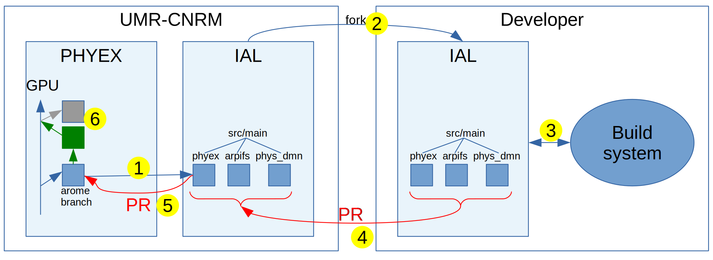
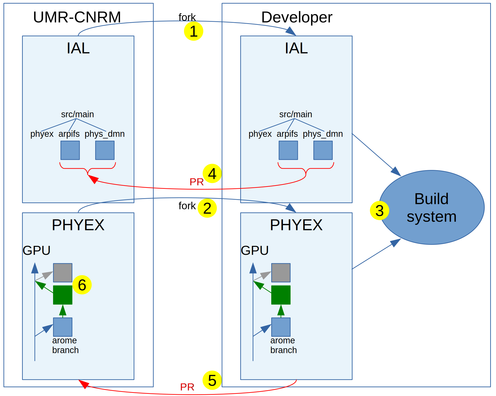

# PHYEX developer documentation

## ABOUT THIS DOCUMENT

This document is intended for developers who want to contribute to the PHYEX package.
Developer who is interested in plugging the physics in a new model can refere to the Plugging documentation.
The topics covered are as follows:

  - [Package organisation](#package-organisation)
  - [Contribution workflow for AROME-HARMONIE developers](#contribution-workflow-for-arome-harmonie-developers)
  - [Contribution workflow for Méso-NH developers](#contribution-workflow-for-mesonh-developers)
  - [Contribution workflow for other developers](#contribution-workflow-for-other-developers)

This document is written using the markdown language. With pandoc, it can be converted to HTML (pandoc -s \<filename\>.md -o \<filename\>.html) or PDF (pandoc -s \<filename\>.md -o \<filename\>.pdf).

## PACKAGE ORGANISATION

The package contains two kinds of branches:

  - generic branches which contain codes for all the models and applications (eg: main and GPU branches)
  - model specific branches which are automaticaly derived from generic branches (eg: arome\_\<commit\_hash\>, mesonh\_\<commit\_hash\>)

The directories found in the package are different depending on the branches (generic or model specific).

For model specific branches, only the source code adapted for a given model is present (one directory per parameterization and an aux directory). No compilation engine or scripts are present in these branches. They are intended to be included directly in the compilation system of the hosting model.

The generic branches contains the folowing directories:

  - docs: for documentation
  - build: an autonomous build system is included in the package. Its usage is covered in the [Offline documentation](./Offline.md)
  - src/common: the main source code which is the basis for all models
  - src/\<model\>: the source code specific to one model that must replace or complement the source code found in the common directory
  - tools: scripts to build model specific branches and run test cases (described in the [Integrator](./Integrator.md) documentation).

Here is a short description of the different generic branches:

  - main: source code without rewriting for GPU transformation
  - GPU: source code adapted for GPU transformations
  - testHUGE: modified source code to check the incomplete NPROMA feature
  - testprogs\_data: modified source code used to generate samples for the test programs (more on this topic in the [Offline documentation](./Offline.md))

## CONTRIBUTION WORKFLOW FOR AROME-HARMONIE DEVELOPERS

The AROME build systems are evolving.
Until cycle 49t1 (included), the physics source code is directly included in the source code tree.
After cycle 49t1, the physics source code (as well as other model parts such as ectrans, fiat...) will be available through "boundles".

This evolution will impact the way to contribute to the PHYEX repository.

Whatever is the cycle, the AROME-HARMONIE developers only see codes coming from arome specific branches (branches named arome\_\<commit\_hash\>). This code is ready for inclusion (array-syntax already transformed into DO loops for instance).

Said differently, developers do not need to manipulate code transformation tools.

## Until cycle 49t1

Workflow summary: because the physics source code is still included in the IAL source code, pull requests concerning the physics continue to follow the same path as before (ie pull requests are submitted to the IAL repository). Afterwards, the IAL integrator will submit a pull request to the PHYEX repository with only the relevant files.

Workflow details (getting the source code in blue, pull request in red, integration in green):

  - 1: PHYEX administrator sends (pull request) the content of a specific arome branch to the IAL Integrator. The IAL integrator tags a new release of IAL.
  - 2: AROME-HARMONIE developer forks the IAL repository
  - 3: AROME-HARMONIE developer compiles, executes, modifies the source code in its environment
  - 4: AROME-HARMONIE developer sends a pull request to the IAL repository
  - 5: The IAL integrator extracts the physics source files and sends a pull request to the PHYEX repository
  - 6: The PHYEX administrator checks and integrates the modifications in the GPU branch and, eventually, produce a new arome specific branch for future integration in IAL

## After cycle 49t1

Workflow summary: after the cycle 49t1 (starting from 49t2?), HARMONIE/AROME will become a boudle. Il will be built with source codes coming from various places. One of these places will be the PHYEX repository. Pull requests must be sent to each modified boundles.

Workflow details (getting the source code in blue, pull request in red, integration in green):

  - 1 and 2: AROME-HARMONIE developer forks the different repositories needed to build the model
  - 3: AROME-HARMONIE developer compiles, executes, modifies the source code in its environment
  - 4 and 5: AROME-HARMONIE developer sends pull requests to the different repositories where files have been modified
  - 6: The PHYEX administrator checks the pull requests in the other applications, the IAL integrator integrates on the arome specific branch; then the PHYEX administrator integrates the modifications in the GPU branch and, eventually, produce a new arome specific branch for future integration in IAL

## CONTRIBUTION WORKFLOW FOR MESO-NH DEVELOPERS

The physics source code is embedded in the Méso-NH source code.

The physics source code comes directly from a mesonh specific branch (these branches are named mesonh\_\<commit\_hash\>) which contain code ready for use in the Méso-NH model (array-syntax...).

Pull requests concerning the physics continue to follow the same path as before (ie pull requests are submitted to the Meso-NH repository). The Meso-NH integrator will submit a pull request to the PHYEX repository with only the relevant files.

## CONTRIBUTION WORKFLOW FOR OTHER DEVELOPERS

Other developers must work with source code comming directly from the GPU branch. They issue pull requests directly on this branch as usual with git repositories.
